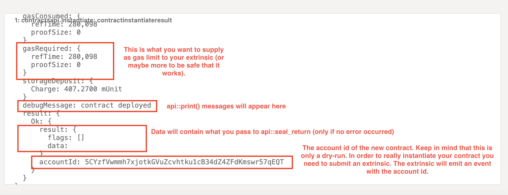

# ink!less flipper

In this exercise you will build the [ink! flipper example](https://github.com/paritytech/ink/tree/master/examples/flipper) without ink!.

## Requirements

- Rust nightly toolchain installed and the `rust-src` component:
  - `rustup toolchain install nightly && rustup +nightly component add rust-src`
- You will be testing your contract against a local [`substrate-contracts-node`](https://github.com/paritytech/substrate-contracts-node/releases).
- We need this tool for postprocessing: `cargo install strip-exports`

## Your task

Fork this repository and the contract here so that it provides the following functionality:

- The contract has a single storage item holding a `bool` value
- The bool value is set on instantiation to either `true` or `false` depending on the constructor
  arguments.
- Provide a `flip()` function which changes the value in storage to its opposite.
- Provide a `get()` function which returns the current value of the `bool` as the result
  of the contract execution.

**We recommend playing around (and deploying) the provided skeleton before making modifications.**

## Building

You can check your code with `cargo check` as you are used to.
It will use the nightly toolchain because of the [`rust-toolchain.toml`](./rust-toolchain.toml) file.
It will also default to building for `wasm32-unknown-unknown` due to the configuration within [`.cargo/config`](./.cargo/config).

In order to build your contract you should call `build-contract.sh` which takes care of some needed postprocessing.
Otherwise the contract will be rejected by `pallet-contracts`.
Your compiled contract is placed at `target/inkless_flipper.wasm` by this script.

## Testing your contract

In order to run your contract you will be using the `Developer -> Runtime calls` and `Developer -> Extrinsics` tabs of Polkadot.js Apps.

**We are not using the `Developer -> Contracts` tab because that only works for ink! contracts.**

- Start your local node by executing the downloaded `substrate-contracts-node` without any arguments.
  - macOS users might need to run `xattr -c ./substrate-contracts-node` on the file to get around gatekeeper
- Connect to the node via [`polkadot js`](https://polkadot.js.org/apps/?rpc=ws%3A%2F%2F127.0.0.1%3A9944#/)

### Dry Running

In order to learn about the gas limit required to instantiate or call your contract you need to dry-run it.
This is also required to call any getter function of your contract as extrinsics can't return data.

Dry running is possible using the `contractsApi` via the `Developer -> Runtime calls` tab:

Submitting this runtime call will return to you the following result:

### Submitting an extrinsic

In order to mutate any state you need to submit an extrinsic.
Those can be found in the `Developer -> Extrinsics -> contracts`.
The interesting extrinsics are `instantiate_with_code` and  `call`.
The former creates a new contract from your code and the latter calls said contract.

Keep in mind that mutating functions of your contract (`flip()`) should be called as extrinsic.
Getter (`get()`) should be using the runtime calls tab because only dry-runs can return data.
